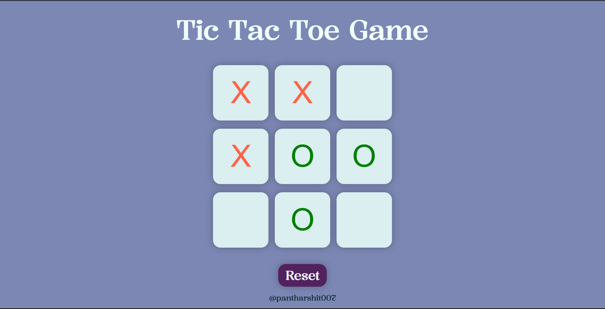
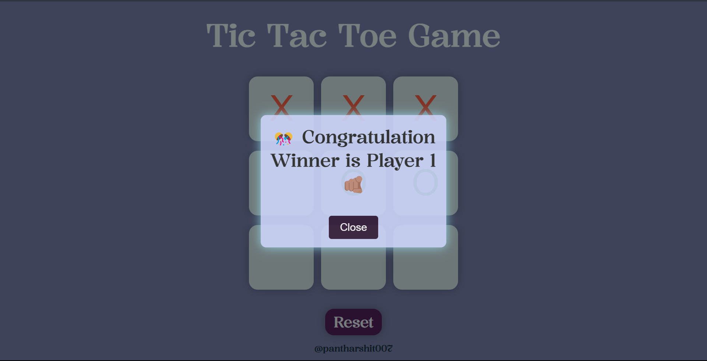

# Tic Tac Toe Game

Welcome to the Tic Tac Toe game! This simple web-based game allows players to take turns marking spaces on a 3x3 grid, aiming to achieve a winning pattern.

## Demo
[Play the game](https://tic-tac-toe007.onrender.com) 

 


## How to Play
- Click on the squares to make your move.
- The game alternates between Player X and Player O.
- Achieve a winning pattern to win the game.

## Future Upgrades
Consider the following enhancements for future upgrades:
- **Improved Styling:** Enhance the visual appeal of the game with additional styling and animations.
- **Multiplayer Mode:** Implement a multiplayer mode, allowing two players to play against each other.
- **Difficulty Levels:** Add difficulty levels for single-player mode, with varying AI capabilities.
- **Scoreboard:** Implement a scoreboard to keep track of the number of wins for each player.
- **Glich:** Sometimes without filling all the block system declare a Draw. 

## Deployed Version
The game is deployed and accessible [here](https://tic-tac-toe007.onrender.com).

## Setup Locally
1. Clone the repository 
```bash
git clone https://github.com/pantharshit007/Tic-Tac-Toe.git
```
2. Open `index.html` in your web browser.

## Technologies Used
- HTML
- CSS
- JavaScript

## Acknowledgments
This project was inspired by the classic Tic Tac Toe game and built for educational purposes.

Feel free to contribute or provide feedback!

## धन्यवाद

